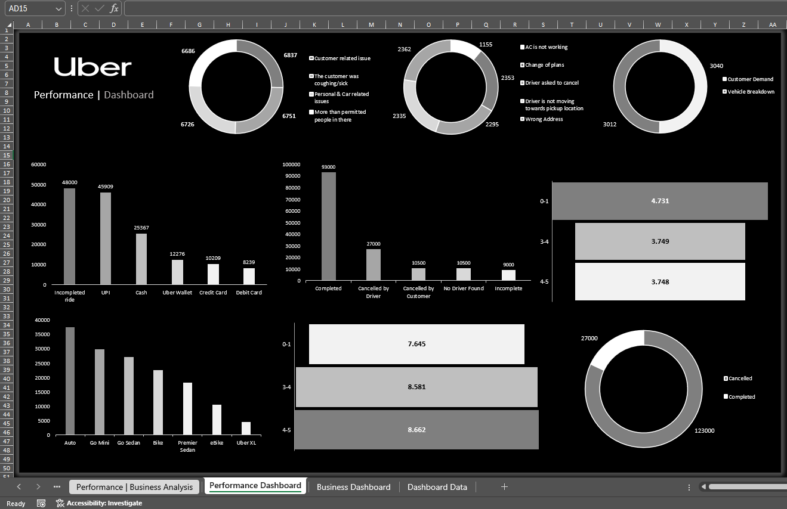
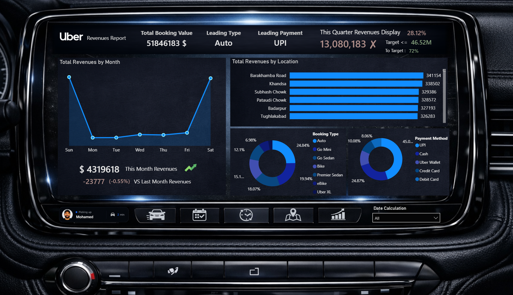
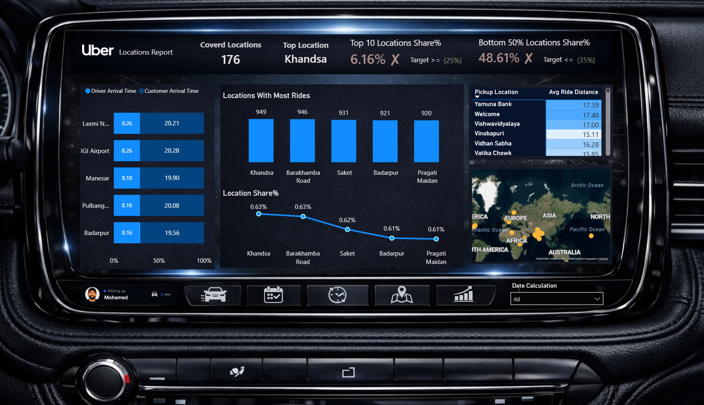
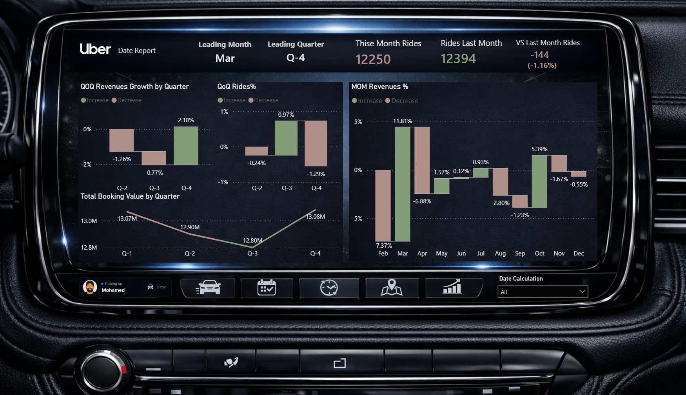
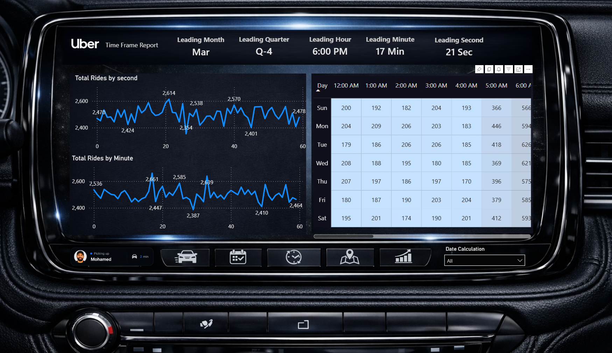

# Uber Ride-Hailing Performance Analytics


A comprehensive ride-hailing analytics solution evaluating trip performance, cancellations, revenue, and geographic demand across 176 locations (Full Year, Jan–Dec) using SQL Server, Power BI (with Tabular Editor calculation groups), Excel, and dimensional modeling (Star Schema).

---

## Project Overview

This project transforms raw booking data into an executive-ready decision framework covering ride operations, revenue, geography, and time-based trends.

**Key Metrics:**
- **150,000** Total Bookings
- **$51.85M** Total Booking Value
- **68.89%** Ride Completion Rate (Target ≥ 90%)
- **38.00%** Cancellation Rate (Target ≤ 10%)
- **176** Locations Covered
- **+2.18%** Q4 Revenue Growth (QoQ) — first positive quarter after two declines

---

## Navigation Pane

- **New to this project?** → [Getting Started](#getting-started)
- **Want dashboards?** → [Dashboards](#dashboards)
- **Interested in the data model?** → [Data Model & DAX](#data-model--dax)
- **Looking for insights?** → [Key Insights](#key-insights)
- **Need tech details?** → [Tech Stack](#tech-stack)
- **Looking for the executive report?** → [Reference Resources](#reference-resources)
- **Contact information?** → [Support & Contact](#support--contact)

---

## Key Insights

### Ride Performance

| Metric | Value | Target | Status |
|---|---|---|---|
| **Completed Rides** | 93,000 (68.89%) | ≥ 90% | ⚠ Missed by 21.1 pts |
| **Cancelled Rides** | 57,000 (38.00%) | ≤ 10% | ⚠ 3.8x over target |
| **No Driver Found** | 10,500 | — | Pure supply failure |
| **Incomplete Rides** | 9,000 | — | — |

**Insight:** Both operational targets were missed simultaneously. Driver-initiated cancellations (27,000) are the single largest loss category — nearly matching customer cancellations and "no driver found" combined.

---

### Cancellation Breakdown

| Cause | Rides | Share of Cancellations |
|---|---|---|
| **Cancelled by Driver** | 27,000 | 47% |
| **Cancelled by Customer** | 10,500 | 18% |
| **No Driver Found** | 10,500 | 18% |
| **Incomplete** | 9,000 | 16% |

**Top Driver Reasons:** Customer-related issue (6,837), customer coughing/sick (6,751), personal & car issues (6,726), more passengers than permitted (6,686) — all within a tight 2.5% band, indicating no single dominant root cause.

**Top Customer Reasons:** Wrong address (2,362), driver not moving toward pickup (2,353), change of plans (2,335), driver asked to cancel (2,295), AC not working (1,155).

---

### Revenue Performance

| Metric | Value |
|---|---|
| **Total Booking Value** | $51.85M |
| **This Quarter Revenue** | $13.08M (72% to $46.52M target) |
| **This Month Revenue** | $4.32M (-0.55% vs last month) |
| **Leading Type / Payment** | Auto / UPI |

**Revenue by Booking Type**

| Type | Revenue |
|---|---|
| Auto | $12.88M |
| Go Mini | $10.34M |
| Go Sedan | $9.37M |
| Bike | $7.84M |
| Premier Sedan | $6.28M |
| eBike | $3.62M |
| Uber XL | $1.53M |

**Revenue by Payment Method**

| Method | Revenue | Share |
|---|---|---|
| UPI | $23.35M | 45.0% |
| Cash | $12.90M | 24.9% |
| Uber Wallet | $6.20M | 12.0% |
| Credit Card | $5.22M | 10.1% |
| Debit Card | $4.18M | 8.1% |

**Insight:** UPI alone drives 45% of revenue and Auto alone drives ~25% — a healthy scale advantage but a concentration risk if either the payment rail or the Auto segment is disrupted.

---

### Location Insights

| Metric | Value | Target | Status |
|---|---|---|---|
| **Covered Locations** | 176 | — | — |
| **Top Location** | Khandsa | — | — |
| **Top 10 Locations Share** | 6.16% | ≥ 25% | ⚠ Missed |
| **Bottom 50% Locations Share** | 48.61% | ≤ 35% | ⚠ Missed |

**Top Revenue Locations:** Barakhamba Road ($341,154), Khandsa ($338,502), Subhash Chowk ($329,386), Pataudi Chowk ($328,572), Badarpur ($327,193), Tughlakabad ($326,283).

**Insight:** Demand is highly fragmented across all 176 locations with no meaningful concentration — the top 10 hold barely a quarter of the target share.

**Arrival Time Gap:** Drivers consistently arrive in ~8.2 minutes while customers take ~20 minutes to reach pickup — a 2.4x gap large enough to plausibly contribute to driver-side cancellations and idle driver time.

---

### Time-Based Trends

**Quarterly Revenue Growth (QoQ)**

| Quarter | Booking Value | QoQ Revenue | QoQ Rides |
|---|---|---|---|
| Q1 | $13.07M | — | — |
| Q2 | $12.90M | -1.26% | -0.24% |
| Q3 | $12.80M | -0.77% | +0.97% |
| Q4 | $13.08M | **+2.18%** | -1.29% |

**Notable Monthly Swings:** February (-7.37%) → March (+11.81%) → April (-6.88%); October (+5.39%).

**Weekend Revenue Premium:** Ride counts peak mid-week (Monday) and dip on Thursday, yet revenue peaks on Sunday ($9.63M) and Saturday ($9.57M) — implying weekend trips are higher-value on average despite not having the highest volume.

**Peak Demand Windows:** Leading hour 6:00 PM · Leading minute 17 · Leading month March · Leading quarter Q4.

---

## Dashboards

### 1. Ride Performance Report


**Purpose:** Track completion vs. cancellation against target thresholds
**Key Metrics:** Total Rides, Completed/Cancelled Display with gauges, Total Rides by Day, Booking-type breakdown

---

### 2. Revenue (Financial) Report


**Purpose:** Monitor booking value against quarterly targets
**Key Metrics:** Total Booking Value, Leading Type/Payment, Revenue by Month, Revenue by Location, Booking Type & Payment Method donuts

---

### 3. Locations Report


**Purpose:** Geographic demand and service-quality analysis
**Key Metrics:** Covered Locations, Top/Bottom Location Share, Driver vs. Customer Arrival Time, Locations with Most Rides, world coverage map

---

### 4. Date Report


**Purpose:** Trend analysis across quarters and months
**Key Metrics:** QoQ Revenue/Rides Growth, MoM Revenue %, Total Booking Value by Quarter

---

### 5. Time Frame Report


**Purpose:** Granular time-of-day and day-of-week demand patterns
**Key Metrics:** Leading Month/Quarter/Hour/Minute/Second, Total Rides by Second/Minute, hourly heatmap by day

---

### 6. Excel Interactive Dashboards


**Purpose:** Self-service analytics with dynamic filtering
**Features:** Revenue by day/month, booking type & payment method breakdowns, cancellation reason donuts, pickup location bars, ride-distance and time-of-day trend lines

---

### 7. Executive PDF Report


**Purpose:** Consolidated, brand-styled report for leadership review
**Contents:** Executive summary, operations, revenue, geography, trends, and a prioritized action plan

---

## Data Model & DAX

### Star Schema

| Table | Type | Purpose |
|---|---|---|
| `Fact_Rides` | Fact | Transactional data — one row per booking |
| `Dim_Booking` | Dimension | Booking status & type |
| `Dim_Customer` | Dimension | Customer attributes |
| `Dim_Payment` | Dimension | Payment method |
| `Dim_Pickup_Location` / `Dim_Drop_Location` | Dimension | Location attributes |
| `Dim_Date` / `Dim_Time` | Dimension | Temporal attributes |
| `Dim_Driver_Cancellation_Reasons` | Dimension | Driver-side cancellation reasons |
| `Dim_Customer_Cancellation_Reason` | Dimension | Customer-side cancellation reasons |
| `Calculations` | Measure table | 67 measures |
| `Time Intelligence` | Calculation group | 9 reusable time-calc items |

### Time Intelligence Calculation Group

Built in Tabular Editor as a single reusable calculation group applied across all measures, avoiding duplicate MoM/QoQ variants per metric:

```dax
Last 30 Days
MoM %
Month-to-Date (MTD)
Previous Quarter (PQ)
Quarter-over-Quarter (QoQ)
Quarter-to-Date (QTD)
Rolling 12 Months
Same Period Last Quarter
Year-to-Go (YTG)
```

### Sample Measures

```dax
Completed Rides % = 
DIVIDE ( [Completed Rides], [Total Rides], 0 )

Cancelled Rides % = 
DIVIDE ( [Cancelled Rides], [Total Rides], 0 )

QoQ Revenue % = 
VAR CurrentQ = [Total Revenues]
VAR PriorQ = CALCULATE ( [Total Revenues], 'Time Intelligence'[Date Calculation] = "Previous Quarter (PQ)" )
RETURN DIVIDE ( CurrentQ - PriorQ, PriorQ, 0 )

Top 10 Locations Share % = 
VAR Top10Revenue =
    SUMX ( TOPN ( 10, VALUES ( Dim_Pickup_Location[Pickup Location] ), [Total Revenues] ), [Total Revenues] )
RETURN DIVIDE ( Top10Revenue, [Total Revenues], 0 )
```

### Row-Level Security

Two model roles were configured in Tabular Editor — **Full Access** and **Financial Restricted access** — to control visibility of revenue-sensitive measures by user group.

---

## Business Recommendations

### High Priority

1. **Target driver-initiated cancellations directly**
   Driver cancellations (27,000) are the largest single loss category, split almost evenly across four causes. Introduce upfront trip/passenger-count confirmation and a simple in-app health/safety decline flow for drivers.

2. **Close the customer pickup-time gap**
   Customers take ~2.4x longer than drivers to reach pickup (~20 min vs ~8 min). Test pickup-pin accuracy improvements, earlier "driver arriving" nudges, and grace-period adjustments.

3. **Investigate "No Driver Found" hot spots**
   10,500 rides failed purely on supply. Cross-reference against hourly/weekday demand to target driver incentives and surge-based positioning.

### Medium Priority

4. **Build density in high-volume corridors**
   With the top 10 locations holding only 6.16% share against a 25% target, concentrate driver incentives around proven high-volume points (Khandsa, Barakhamba Road, Saket, Badarpur, Pragati Maidan) rather than spreading supply across all 176 locations.

5. **Capitalize on the weekend revenue premium**
   Weekend trips generate disproportionately higher revenue despite comparable volume. Explore weekend premium-vehicle promotions or dynamic pricing refinements.

### Lower Priority

6. **Monitor UPI concentration risk**
   UPI represents 45% of revenue — maintain payment-rail redundancy and monitor uptime given the scale of dependency on a single method.

7. **Sustain the Q4 recovery**
   Q4 marked the first positive QoQ revenue growth (+2.18%) after two declining quarters. Review what drove the March rebound (+11.81% MoM) to replicate conditions into the next fiscal year.

---

## 🛠️ Tech Stack

| Component | Technology |
|---|---|
| **Database** | SQL Server 2019+ |
| **Dashboards** | Power BI Desktop |
| **Semantic Modeling** | Tabular Editor 2.28 (calculation groups, RLS roles) |
| **Analysis** | Excel (Power Query, Power Pivot) |
| **Language** | DAX / T-SQL |
| **Modeling** | Star Schema (Dimensional) |
| **Reporting** | Python (ReportLab) |

---

## Getting Started

### Prerequisites
- SQL Server 2019 or higher
- Power BI Desktop (free or paid)
- Tabular Editor 2.x (for calculation groups & RLS roles)
- Excel 2016 or higher
- Git (optional)

### Installation

1. **Clone the repository**
```bash
git clone https://github.com/mohamedfouad00/Uber-Ride-Hailing-Analytics.git
cd Uber-Ride-Hailing-Analytics
```

2. **Set up SQL Server**
   - Create the star schema tables using scripts in `SQL/Schema_Creation.sql`
   - Load booking data into `Fact_Rides`
   - Load dimension tables: `Dim_Booking`, `Dim_Customer`, `Dim_Payment`, `Dim_Pickup_Location`, `Dim_Drop_Location`, `Dim_Date`, `Dim_Time`, and the two cancellation-reason dimensions

3. **Open Power BI Dashboards**
   - Connect to your SQL Server instance
   - Open `.pbix` files in Power BI Desktop
   - Refresh data connections

4. **Open in Tabular Editor (optional)**
   - Connect to the live Power BI model
   - Review the `Time Intelligence` calculation group and `Full Access` / `Financial Restricted access` roles

5. **Open Excel Dashboard**
   - Enable Power Query connections
   - Refresh pivot tables and slicers

---

## Project Structure

Uber-Ride-Hailing-Analytics/
├── Dashboards/
│ ├── Performance_Report.png
│ ├── Financial_Report.png
│ ├── Location_Report.png
│ ├── Date_Report.png
│ ├── Time_Frame_Report.png
│ └── Excel_Business.png
├── SQL/
│ └── Schema_Creation.sql
├── Reports/
│ └── Uber_Executive_Performance_Report.pdf
├── README.md
└── .gitignore

---

## Reference Resources

- [Power BI Live Reports](#)
- [Star Schema Design — Wikipedia](https://en.wikipedia.org/wiki/Star_schema)
- [Uber Ride-Hailing Performance Report (Executive PDF)](Reports/Uber_Executive_Performance_Report.pdf)

---

## Support & Contact

**Project Author:** Mohamed Fouad  
**Role:** Data Analyst  
**Email:** m.fouad.business002@gmail.com  
**LinkedIn:** [Mohamed Fouad](https://linkedin.com/in/mohamed-fouad-88608424b)  
**GitHub:** [@mohamedfouad00](https://github.com/mohamedfouad00)

---

## License

This project is provided as-is for educational and business analytical purposes.

---

## Contributing

Contributions are welcome! Please follow these steps:

1. Fork the repository
2. Create a feature branch (`git checkout -b feature/amazing-feature`)
3. Commit your changes (`git commit -m 'Add amazing feature'`)
4. Push to the branch (`git push origin feature/amazing-feature`)
5. Open a Pull Request

---

**Last Updated:** 2026  
**Data Period:** Full Year (Jan – Dec)  
**Dataset:** Uber Ride-Hailing Booking Records
